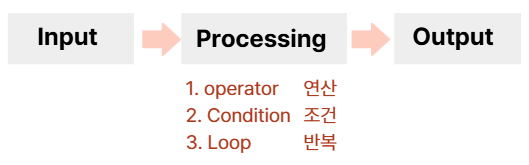
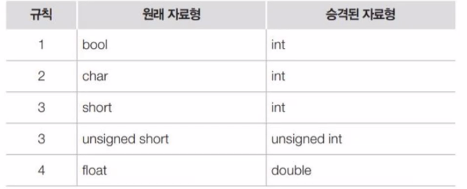
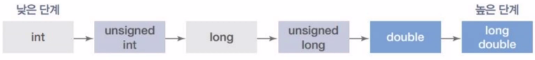

# iot-cpp-programming-2026

# 4일차(03.04)
## 4일차 오전
### 1. C++의 동적 할당 (`new`&`delete`)
- `new` : 메모리 할당 + **생성자 호출**
- delete : 소멸자 호출 + 메모리 해제
- 배열 형태 : new int[size]로 만들었다면, 반드시 delete[]로 지워야 함

### 2. 소멸자(Destructor)
- 형태 : ~클래스명()
- 역할 : 객체가 수명을 다할때(중괄호를 벗어나거나 delete될 때) 자동으로 호출되어 뒷정리를 함
- 핵심 : 클래스 내부에서 new를 했다면, 소멸자에서 반드시 delete를 해줘야 메모리 누수가 없음

### 3. 복사 생성자 & 깊은 복사
- 문제점 : 기본복사는 포인터 주소만 복사(얕은복사). 이로인해 두 객체가 같은 메모리를 가리키다 소멸 시 에러(Double free) 발생
- 해결책 : 복사 생성자를 직접 정의하여 새로운 메모링 공간을 할당하고 내용물을 복사

### 4. 대입 연산자 오버로딩(`operator=`)
- 이미 생성된 개게끼리 값을 주고받을때 사용
- 자기 대입 방지 : `if(this == &other)` 처리 필수
- 기존 메모리 해제 : 새로 할당받기전에 내가 들고 있던 옛날 메모리를 먼저 지워야 함

## 오후

### 1. 복합 대입 연산자
`+=`, `-+`, `*=`, `/=` 등을 복합 대입 연산자 라고 함
- 특징 : `a += b;`는 `a = a + b;` 와 의미는 같지만, 동작은 **'나 자신'에게 연산 결과를 바로 업데이트 하는 방식**
- **반환 타입** : **`Person&`(참조)**를 반환하는 것이 표준. 그래야 연속 연산이 가능하기 때문

### 2. 임시 객체
코드 한 줄(명령문) 안에서 잠깐 태어났다가 사라지는 이름 없는 객체
#### 언제 생기는가?
1. 함수에서 객체를 **값으로 반환(return by value)** 할 때.
2. 연산중에 결과 값을 잠깐 들고 있어야 할때(`p1 + p2` 의 결과)
3. 형 변환이 일어날 때
**성질** : 개발자가 이름을 붙여주지 않았기에, 해당 줄에서 볼일을 마치면 소멸

### 3. 수명
- **다음 명령문이 실행되면 날아가버림**
- C++ 표준에서는 **세미콜론( `;` )을 만나는 순간 소멸**한다고 표현
#### 위험한 이유(주의)
```
const char* name = (Person("임시", 20)).getName();
// Person 객체는 이 줄이 끝나면(;) 소멸자(~Person)를 호출하로 날아감
// 그럼 name 포인터는 방금 파괴된 메모리를 가리키는 '쓰레기 주소'를 들고있게 됨
```

### 4. 이동 생성자
복사 생성자가 '복사'를 한다면, 이동 생성자는 원본의 자원을 **'뺏어오는'** 방식
- **필요성** : 큰 메모리를 가진 객체(동적 할다된 문자열 등)를 복사할 때, 굳이 똑같은 걸 새로 만들지 않고 주소값만 옮겨서 성능을 높이기 위함
- **핵심 로직**
    1. `this`의 포인터가 `other`의 메모리 주소를 가리키게함
    2. **중요!** `other`의 포인터를 `nullptr`로 만들어 연결을 끊음(원본이 소멸될 때 내 메모리까지 날아가지 않게 하기 위함)
- **특징** : `noexcept` 키워드를 붙여 예외가 발생하지 않음을 보장하는 것이 성능 최적화(특히 STL 컨테이너 사용 시)에 유리

### 5. `const` 함수 오버로딩
함수의 이름이 같아도 `const` 여부에 따라 호출되는 함수가 달라지는 성질
- **규칙**
    - **일반 객체** : 일반 함수를 우선 호출
    - **상수(const) 객체** : 반드시 `const`가 붙은 함수만 호출 가능
- **실전 활용**
```
void SimpleFunc() { ... }          // 데이터 수정 가능 버전
void SimpleFunc() const { ... }    // 데이터 읽기 전용 버전
```
- **의의** : `const` 참조(`const Person& obj`)로 전달된 객체는 함수 내부에서 값의 변형이 일어날 수 없음을 컴파일 단계에서 보장

### 6. 디폴트 매개변수를 이용한 생성자 통합
기본 생성자( `Person()` )를 따로 만들지 않고도 기본 객체를 생성할 수 있게 만드는 효율적인 기법
- **방법** : 일반 생성자의 매개변수에 기본값(Default Value)을 설정함
- **장점** : 코드의 중복을 줄이고, 다양한 인자 조합으로 객체를 유연하게 생성할 수 있음
    - 예 : `Person(int id = 0, const char* n = nullptr)`
    - 결과 : `Person p1;` (id=0), `Person p2(101);` (id=101), `Person p3(101, "김");` 모두 지원.

### 7. 프렌드(friend)선언
특정 클래스나 함수에게 나의 `private` 멤버에 접근할 수 있는 **마스터 키**를 **넘겨주는** 선언
- **특징**
    - 프라이빗(private) 멤버의 접근을 매우 쉽게 만들어 줌
    - **정보은닉**의 원칙을 깨뜨리는 선언이므로, 꼭 필요한 경우가 아니면 사용을 지양
- **방향성**
    - "나를 친구로 인정해줘" 부탁 XX
    - "내가 너를 친구로 인정할게(비밀 오픈)" 선언
    - 즉 **비밀을 가진쪽(피접근자)**에서 권한을 부여

#### 예시
```
class Girl; // Girl이라는 클래스가 있다는 것을 미리 알림 (전방 선언)

class Boy {
private:
    int secretAmount = 10000;

    // Boy가 Girl을 친구로 선언 (이제 Girl은 Boy의 private을 볼 수 있음)
    friend class Girl; 
};

class Girl {
public:
    void checkBoySecret(const Boy& b) {
        // 원래는 접근 불가능한 private 멤버에 접근 가능!
        cout << "그의 비밀 자금은 " << b.secretAmount << "원이야." << endl;
    }
};
```

### 8. static 키워드 (정적 멤버)
#### 함수 내 static변수
- **의미** : 함수가 종료되어도 메모리에서 사리지지 않고 **값을 유지** 하는 변수
- **특징**
    - **딱 한번만 초기화** 됨
    - 지역 변수처럼 보이지만, 수명은 **프로그램 종료 시** 까지

#### 클래스 내 static 멤버 (정적 멤버 변수)
- **공유 변수** : 객체(인스턴스)별로 생성되는것이 아니라, **클래스당 딱 하나만 존재**하며 모든 객체가 이를 공유
- **소속** : 특정 객체의 소유가 아닌 **클래스의 소유**
- **초기화** : 프로그램 실행과 동시에 메모리(데이터 영역)에 할당됨
> 단, 클래스 외부에서 반드시 초기화 선언을 해줘야 함
- **접근 방법** 
    1. 클래스 이름을 통한 접근(권장) : `ClassName::variable`
    2. 객체 이름을 통한 접근 : `obj.variable`

#### static 멤버 함수
- 특징 : 객체를 생성하지 않고도 `클래스명::함수명()` 으로 호출이 가능
- 제약 : static 멤버 함수 내부에는 **일반 멤버 변수**나 **`this` 포인터를 사용할 수 XXXX**
> 객체가 없어도 호출될 수 있어야 하므로, 클래스 소속인 static멤버만 다룰 수 있음

// 5일차 부터 여기였었는데
### 9. const static 멤버와 mutable 

const static 멤버와 mutable

# 6일차(03.06)
## Programming Language
### C++ 언어의 지향점
- 절차형 패러다임 + 객체지향 패러다임
- C++같은 경우에는 객체부분이 부족하더래도 절차로 이어지는 부분
- JAVA는 완전 태생부터 객체라 제대로 선언해야 함

### 프로그래밍 언어의 Schema
세상에 존재하는 프로그래밍 언어의 기본은 이것



C++이 기본적으로 4byte로 연산을 하기에
true+100하면 101이 나오는것 

규칙성을 찾아 코드를 줄이려고 반복문을 사용했었지

배열 - 복수계
까다로웁 사이즈도 정하고 해야되서
스트링같은 컬렉션을 만드는 것

프로세싱을 묶어서 하나의 단위를 만드는 것
=> 함수(function)

변수를 여러개를 쓰려고하다 배열이 나온것 처럼

여기서 +a가 그 언어의 특징이다
그언어가 지향하는 것과 컨셉을 파악하면 이해하기가 쉬워진다

파이썬 - 쉬운언어가 컨셉
자바 - 명확한언어가 컨셉
타입 변수 값이 명확해야한다
그래서 내가 안좋아하는듯
C++ - C의 컨셉 + 객체의 컨셉

### 변수(Variable)
| 자료형 키워드 | 크기 (Byte) | 기본값 (Default Value) | 비고 |
| :--- | :---: | :---: | :--- |
| **bool** | 1 | `false` | 정수 0과 동일 |
| **char** | 1 | `'\0'` | NULL 문자 (ASCII 0) |
| **unsigned char** | 1 | `0` | |
| **short** | 2 | `0` | |
| **unsigned short** | 2 | `0` | |
| **int** | 4 | `0` | |
| **unsigned int** | 4 | `0` | |
| **long** | 4 또는 8 | `0L` | OS 환경에 따라 다름 |
| **unsigned long** | 4 또는 8 | `0UL` | OS 환경에 따라 다름 |
| **long long** | 8 | `0LL` | |
| **unsigned long long** | 8 | `0ULL` | |
| **float** | 4 | `0.0f` | 부동 소수점 0 |
| **double** | 8 | `0.0` | 부동 소수점 0 |
| **long double** | 8 ~ 16 | `0.0L` | 환경에 따라 정밀도 차이 |
type
void
string
input과 output을 위해 선언하는 것이 변수

float의 기본값 0.0
type 변수명;
전역변수나 static이 붙으면
기본값을 가지는데

큰게 작은게 되면 명시적으로 선언을 해줘야 함

변수를 사용하려면 기본적으로
선언과 초기화가 필요
이러면 할당이 됨
그래야 사용을 할 수 있음
할당이 되지 않으면 기본값으로 저장(전역, static의 경우)

<< stream 인설션 연산자
endl 깔끔하게 비우는 대신 조금 느릴 수 있다

연산이 될 때 성분이 바뀜
a가 가지고 있는 char이 숫자로 바뀔때 값이 생긴다
대문자 A 65
소문자 a 97
숫자 0   48
이렇게 3가지 알아두기

#### 암묵적 자료형 승격

CPU가 효율적으로 처리할 수 있는 기본 정수 단위가 보통 32비트(int) 이기 때문

int는 오버플로우
float는 인피니티


#### 명시적 자료형 변환(캐스팅)

재사용성을 극대화하기위해 객체지향을 맹글엇ㅇ다

### Processing - 연산자

산술
증감
관계
논리
대입
복합 대입
조건
비트
주소
포인터
크기
형 변환
멤버 접근
범위 지정
인덱스
함수 호출
쉼표

스위치 이론
논리합 논리곱

### Processing - 조건
if(조건) 문장;
if(조건){문장들. . .}
if(조건){문장;} else {문장;}
if(조건){문장;} else if(조건) {문장;} else {문장;}
중첩 if
switch case 문
삼항 연산자

기계로 바꿧을때 가장 가벼운건 switch case문

규칙성

초기 조건 증감

2~9단

for문 - 정해져있는 반복의 횟수가 있을때
        lenth만큼이라 던가

while - 언제 끝날지 모름

do-while - 무조건 한번은 실행해야 할 때

while (조건) { 문장; }
while (num != -1) { 문장; }
while (cin >> num) { 문장; }
while (infile >> num) { 문장; }
do while (조건) { 문장; }
중첩 반복문

while문으로 내마음속 숫자 맞추기 게임

for while do-while

return - 함수, 반복문에서 사용하면 종료
break - 반복문에서 멈춤
continue - 반복문에서 멈추고 조건 확인

### 함수(function)
장점 : 재사용, 분할처리, 오류확인
함수 구조

리턴 자료형 함수 이름(매개변수){
    본문
}

- 라이브러리 함수
> cpp 자체에서 추가해놓은 함수

- 사용자 정의 함수
> 사용자가 직접 만든 함수

