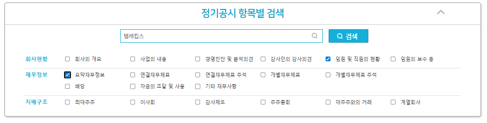
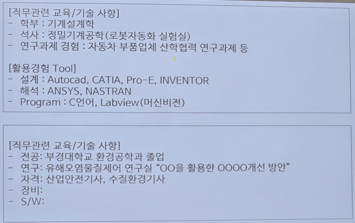

# iot-cpp-programming-2026

# 4일차(03.04)
## 4일차 오전
### 1. C++의 동적 할당 (`new`&`delete`)
- `new` : 메모리 할당 + **생성자 호출**
- delete : 소멸자 호출 + 메모리 해제
- 배열 형태 : new int[size]로 만들었다면, 반드시 delete[]로 지워야 함

### 2. 소멸자(Destructor)
- 형태 : ~클래스명()
- 역할 : 객체가 수명을 다할때(중괄호를 벗어나거나 delete될 때) 자동으로 호출되어 뒷정리를 함
- 핵심 : 클래스 내부에서 new를 했다면, 소멸자에서 반드시 delete를 해줘야 메모리 누수가 없음

### 3. 복사 생성자 & 깊은 복사
- 문제점 : 기본복사는 포인터 주소만 복사(얕은복사). 이로인해 두 객체가 같은 메모리를 가리키다 소멸 시 에러(Double free) 발생
- 해결책 : 복사 생성자를 직접 정의하여 새로운 메모링 공간을 할당하고 내용물을 복사

### 4. 대입 연산자 오버로딩(`operator=`)
- 이미 생성된 개게끼리 값을 주고받을때 사용
- 자기 대입 방지 : `if(this == &other)` 처리 필수
- 기존 메모리 해제 : 새로 할당받기전에 내가 들고 있던 옛날 메모리를 먼저 지워야 함

## 오후

### 1. 복합 대입 연산자
`+=`, `-+`, `*=`, `/=` 등을 복합 대입 연산자 라고 함
- 특징 : `a += b;`는 `a = a + b;` 와 의미는 같지만, 동작은 **'나 자신'에게 연산 결과를 바로 업데이트 하는 방식**
- **반환 타입** : **`Person&`(참조)**를 반환하는 것이 표준. 그래야 연속 연산이 가능하기 때문

### 2. 임시 객체
코드 한 줄(명령문) 안에서 잠깐 태어났다가 사라지는 이름 없는 객체
#### 언제 생기는가?
1. 함수에서 객체를 **값으로 반환(return by value)** 할 때.
2. 연산중에 결과 값을 잠깐 들고 있어야 할때(`p1 + p2` 의 결과)
3. 형 변환이 일어날 때
**성질** : 개발자가 이름을 붙여주지 않았기에, 해당 줄에서 볼일을 마치면 소멸

### 3. 수명
- **다음 명령문이 실행되면 날아가버림**
- C++ 표준에서는 **세미콜론( `;` )을 만나는 순간 소멸**한다고 표현
#### 위험한 이유(주의)
```
const char* name = (Person("임시", 20)).getName();
// Person 객체는 이 줄이 끝나면(;) 소멸자(~Person)를 호출하로 날아감
// 그럼 name 포인터는 방금 파괴된 메모리를 가리키는 '쓰레기 주소'를 들고있게 됨
```

### 4. 이동 생성자
복사 생성자가 '복사'를 한다면, 이동 생성자는 원본의 자원을 **'뺏어오는'** 방식
- **필요성** : 큰 메모리를 가진 객체(동적 할다된 문자열 등)를 복사할 때, 굳이 똑같은 걸 새로 만들지 않고 주소값만 옮겨서 성능을 높이기 위함
- **핵심 로직**
    1. `this`의 포인터가 `other`의 메모리 주소를 가리키게함
    2. **중요!** `other`의 포인터를 `nullptr`로 만들어 연결을 끊음(원본이 소멸될 때 내 메모리까지 날아가지 않게 하기 위함)
- **특징** : `noexcept` 키워드를 붙여 예외가 발생하지 않음을 보장하는 것이 성능 최적화(특히 STL 컨테이너 사용 시)에 유리

### 5. `const` 함수 오버로딩
함수의 이름이 같아도 `const` 여부에 따라 호출되는 함수가 달라지는 성질
- **규칙**
    - **일반 객체** : 일반 함수를 우선 호출
    - **상수(const) 객체** : 반드시 `const`가 붙은 함수만 호출 가능
- **실전 활용**
```
void SimpleFunc() { ... }          // 데이터 수정 가능 버전
void SimpleFunc() const { ... }    // 데이터 읽기 전용 버전
```
- **의의** : `const` 참조(`const Person& obj`)로 전달된 객체는 함수 내부에서 값의 변형이 일어날 수 없음을 컴파일 단계에서 보장

### 6. 디폴트 매개변수를 이용한 생성자 통합
기본 생성자( `Person()` )를 따로 만들지 않고도 기본 객체를 생성할 수 있게 만드는 효율적인 기법
- **방법** : 일반 생성자의 매개변수에 기본값(Default Value)을 설정함
- **장점** : 코드의 중복을 줄이고, 다양한 인자 조합으로 객체를 유연하게 생성할 수 있음
    - 예 : `Person(int id = 0, const char* n = nullptr)`
    - 결과 : `Person p1;` (id=0), `Person p2(101);` (id=101), `Person p3(101, "김");` 모두 지원.

### 7. 프렌드(friend)선언
특정 클래스나 함수에게 나의 `private` 멤버에 접근할 수 있는 **마스터 키**를 **넘겨주는** 선언
- **특징**
    - 프라이빗(private) 멤버의 접근을 매우 쉽게 만들어 줌
    - **정보은닉**의 원칙을 깨뜨리는 선언이므로, 꼭 필요한 경우가 아니면 사용을 지양
- **방향성**
    - "나를 친구로 인정해줘" 부탁 XX
    - "내가 너를 친구로 인정할게(비밀 오픈)" 선언
    - 즉 **비밀을 가진쪽(피접근자)**에서 권한을 부여

#### 예시
```
class Girl; // Girl이라는 클래스가 있다는 것을 미리 알림 (전방 선언)

class Boy {
private:
    int secretAmount = 10000;

    // Boy가 Girl을 친구로 선언 (이제 Girl은 Boy의 private을 볼 수 있음)
    friend class Girl; 
};

class Girl {
public:
    void checkBoySecret(const Boy& b) {
        // 원래는 접근 불가능한 private 멤버에 접근 가능!
        cout << "그의 비밀 자금은 " << b.secretAmount << "원이야." << endl;
    }
};
```

### 8. static 키워드 (정적 멤버)
#### 함수 내 static변수
- **의미** : 함수가 종료되어도 메모리에서 사리지지 않고 **값을 유지** 하는 변수
- **특징**
    - **딱 한번만 초기화** 됨
    - 지역 변수처럼 보이지만, 수명은 **프로그램 종료 시** 까지

#### 클래스 내 static 멤버 (정적 멤버 변수)
- **공유 변수** : 객체(인스턴스)별로 생성되는것이 아니라, **클래스당 딱 하나만 존재**하며 모든 객체가 이를 공유
- **소속** : 특정 객체의 소유가 아닌 **클래스의 소유**
- **초기화** : 프로그램 실행과 동시에 메모리(데이터 영역)에 할당됨
> 단, 클래스 외부에서 반드시 초기화 선언을 해줘야 함
- **접근 방법** 
    1. 클래스 이름을 통한 접근(권장) : `ClassName::variable`
    2. 객체 이름을 통한 접근 : `obj.variable`

#### static 멤버 함수
- 특징 : 객체를 생성하지 않고도 `클래스명::함수명()` 으로 호출이 가능
- 제약 : static 멤버 함수 내부에는 **일반 멤버 변수**나 **`this` 포인터를 사용할 수 XXXX**
> 객체가 없어도 호출될 수 있어야 하므로, 클래스 소속인 static멤버만 다룰 수 있음

// 5일차 부터 여기
### 9. const static 멤버와 mutable 

const static 멤버와 mutable

# 취업특강
## 취업 3가지
1. 채용정보
2. 직무역량
- 코드 보단 의도 위주
- 인사쪽에서 보기 때문
1) 교육
- 전공
- 실무
전공 + 실무 > 실무 > 전공
2) 자격, 기술
자격이 앞선다 우선이라는게 아니고 기본

3) 경력, 경험
직무역량은 이 3가지만 봄
성격이 들어가면 X
3. 표현전략
- 무엇을 표현하느냐에 따라 달라진다
- 프로젝트 명을 쓸때도 우리끼리의 이름XX

강사님 메일
trinity0905@gmail.com

입사지원서
자기소개서
무엇이 더 중요할까?
입사지원서가 훨씬 중요하다
입사지원서는 가산점의 방식이고
자기소개서는 감점의 방식
내가 가지고있는게 많으면 많을수록 가산점이 많다
하나하나가 다 가산점이 된다

자격증 : 전문분야의 자격증은 있어야 기본이 되는 것
그래야 객관적으로 볼수 있기에
중요도로 따지면 없으면 안되는 것

프로젝트 : 경험은 된다고 보는 편
- 어떤지 몰름
- 가장 후순위라고 할 수 있다

코딩 Test : 객관적으로 능력을 볼 수 있음

코테가 있는 기업은
코테가 1순위

산업통상자원부

우리 분야는 직업 직무보다
**산업이 중요**하다
산업 vs 직무
반도체  펌웨어 하드웨어 개발

 채용정보로 찾을때는
 직무로 접근하기 보다는
 산업으로 접근하는게 좋다

 유망한 산업에서
 내가 할수있는것에 지원하는게

 거의 모든 분야에서 학점을 보지 않음
 학과는 아직도 중요성이 있다

 추천하는 자소서 작성 꿀팁 X
 강사님의 강의를 열심히 들어라
 1.기업
 - 지원동기 
- 1분 자기소개
> 내가 너희 기업에 얼마나 열정이 있고 관심있고(사업), 너네 회사 이런 사업을 한다는걸 알고 있는걸 표현
>> 너네 기업이 먼저 와야한다


 2.직무능력
 - 교육
 - 자격기술
 - 경력, 경험
 > 인성이나 이런게 섞이면 안된다
 > 이 모든걸 영끌해서 해야함

 3.인성
 - AI로 쓴걸 알고있기에 면접에서 확인하겠다 이런느낌

 그래서 제대로 쓰여진 자소서 작성 가이드가 없다

 AI활용
 - 글을 쓰는 구성은 앎
 - 프롬프트 : 질문의도, 답변의도를 잘주어야 함
 - 글의 구조를 잘 맞춰야 한다
 - 기업 > 사업 > 그안에서 하고싶은것
 - 구조는 AI에게 맞길만 하다
 - 초안을 작성하기에 좋다

회사에서 어느정도의 직무역량을 원하는지

2022년에 현차 생산직을 400명 채용하겠다
- 학력 무관
- 자격 무관
- 18만명 지원

채용을 상태 평가므로 정해진게 없다

1. 세상의 센서가 켜져있는 사람이 이긴다
- 하루의 몇번이라도 산업뉴스를 꼭 봐야한다
2. 고민만 하지 말고 프로젝트나 얘기를 꼭 들어봐라, 판도가 흐르는 방식을 들어야 한다

유망 분야에 대한 정보
1. 링크드인
2. 잇다


### 이과정을 하면서 뭘하면 좋을지
1. 포트폴리오 - PPT로 정리(기록, 상대편이 보기 좋은 방식)
- 깃허브의 가시성이 좋지 않을때는 피피티로 정리하는게 좋다
- 기술 - Tool, 기술 스택, 
- C++이 어느정도 수준인지 기록
    - 이걸로 무엇을 할 수 있다

2. 프로젝트 기술서
- 프로젝트 목적, 주제, 의도가 잘 드러나도록 작성해야 한다
- 기술적 요소나 업무의 내용을 잘 적어둬야 한다

직무적합성이 마련이 되지 않으면 인성을 보여줄 수 없음


서류 - 코테 - 면접 순

면접 - 실제 실무 능력으로
이런 상황에서는 어떤 기술을 선호하는가?
그 기술의 장단점이 있을까?
이런식으로 

표현 전략 :
1. 기출 질문, 예상질문 - **기업/직무**/인성
2. 정보 수집 및 정리
3. 답변 정리
4. 연습 - 뷰인터(AI면접)

직무능력
교육
자격기술 
경력경험
외에는 일머리가 중요

연봉의 기준점
1. 기업 매출액 - 원가 = 이윤
규모가 클수록, 부가가치가 높을수록
규모, 산업의 종류

연봉을 볼 수 있는 사이트- catch
기업은 사원수와 연봉을 보아야 한다

### 취업자리 알아보는법

내가 지원할 분야 결정 준비가 된 사람
1. 채용공고 - 부울경 / 직무분야

어느 분야를 가야할지 모르겠다

2. 기업정보 - 어느지역, 준비
지나간/ 다가올 채용공고
- 자격요건 / **우대**사항을 알아봐야함'
우대가 중요함
남들보다 차별화 되어야 함

기업 <-> 채용

검색어 : IOT, 임베디드, 시스템 개발

|기업|지역|연봉|직무|영어|자격|경력, 경험|기술스택|우대|
|---|---|---|---|---|---|---|---|---|
|하나증권|미정|5600|IT|토익, 토스, 텝스 등|SQL(D), 정보처리기사<br> 정보보안기사, 빅데이터 전문가||스마트홍보대사, 디지털 파워온 프로젝트 수료자,<br> 하나증권 글로벌 아카데미 활동 우수자|

||||||||||

~~관련 프로젝트
직무내용에ㅔ 대해 잘 저장해야

취업을 해서 나중에 옮기는 방법도 있음

NCS 시대
직무중심채용
1. 수시채용 : 직무별
2. 직무역량 : 자격증, 기업활동, 실무교육
3. 경력직 - 인턴, 계약직 뭐든 시작하기(같은 분야)
규모가 작은데서 경력이라는 스펙을 쌓아야

카테고리별로 필기가 되어있어야 함

규모
매출액, 직원수를 기준으로 나뉨
대기업
중견기업
중소기업

재정출자 기준
국가기관(공무원)
공공기관(공+사)  << NCS는 여기에 해당
- 블라인드 채용(나이를 알 수 없음)
- 경력으로만 가늠
- 만 60세 이하면 가능

사기업
- 생각보다 나이 제한이 없음

다만, 공백의 제한이 있음
1~2년 가지고 그정도는 고려하지 않음


경력을쌓는게 너무 중요
다른분야 코딩도 당연히 써도 된다

연관성
1. 직무 - 딱, 전체
> IT 전체에 대한 연관성
2. 산업
3. 기업

일때 연관성이 있다고 본다
중요도 순서로 작성해야 한다
레벨이 높은거부터 뒤로
직무에 맞는것 부터 먼순으로

채용공고
직무역량
그것을 표현하는 전략이 있어야 한다
1. 표로 정리 이게 젤 처음
하루에 하나만 정리해도 마음이 좀 편해진다

기업정보
catch
규모, 사원수, 매출액, 평균 연봉
DART

매출 변동을 볼수있는점이 좋다
자본금과 매출액 변동을 봐야 한다
매출액을 확인해야
육아휴직 잘떼고 있는지 이런거

인원 대비 매출액이 중요

채용조건을 저장해두고 불러올 수 있어야함
링크드인 - 프로필 등록

캐치    << 일잘함
사람인
잡코리아
원티드 < 개발자들이 많이 봄
- 채용조건 설정해서 알림설정


링크드인 은 꼭 해라
잇다
이렇게 두가지

엑셀이나 스프레드시트에 저장 해야겠다

증명사진을 미리 찍어두면 좋음
배경은 무조건 파란색

보유 기술
카테고리별로 분류

존경하는 멘토가 있냐는 말을 왜 물어볼까?

당신의 인생에서 가장 큰 영향을 미친 인물이나 사건?
가치관을 알기위해
다른 사람에 대한 태도, 발전하려는지
존경하는 사람/멘토 : 완벽할 필요가 없다
내가 부족한 분야를 찾는것 : 냉철한 판단
이 분야만 잘하면 됨
칼의 노래 - 이순신 장군
- 이러한 문구를 읽으면 냉철한 판단이 가능해 짐
- ~~이랑 대화를 나누다 보면 냉철한 판단이 가능해 진다

절대 적을 만들지 말아라

**프로젝트 기술서**

인원
일정
프롬프트

**주제**
**기술**
`프로젝트 제작 의도`
**나의 역할**
**결과**
**프로젝트 output**

아직 ai는 의도를 파악할 수 없다

기업 양식이 있을 경우 무조건 기업 양식을 따라야 한다

웃는 표정의 선한 눈매에 신뢰감 있는 표정
이마, 귀, 목선 정돈
파란색 배경, 사진크기
복장 (면접용 정장)

입사지원서
- 형식
- 완성도

검은색 넥타이x

절대 주민등록번호 적으면 안됨

주소는 번지까지만 적으면됨
입사 확인되면 끝까지 적던지 하면된다

경력을 산정하는데 몇가지 중요한 요소

게임 1년
보안 기간제 6개월
정산 6개월

일단 다쓰고
그걸 산정할지 말지는 회사가 알아서 할테니깐

2022.03 ~ 2025.02 이런식으로 두자리를 씀

채용공고
기업정보
자격증 선택

시간이 많고 
단계가 복잡한것
1. 쪼개기 : IoT 채용공고
            가장 많이 나오는 자격증 찾기
            자격증 일정 알아보기
            과목 알아보기
            책사기
            인강 결제
            공부 과정 살피기 
이런식으로 쪼개서 해야한다

매일하는 시스템 만들기
or 단계를 쪼개기

### 해야하는 것
- 기업 정보 표만들기(채용공고 정리)
> 매일 어떤 검색어로 정리할지 (기업 2개씩)
- 영어 성적
    - 토익 인강(일주일에 두번)

- 자격증 취득
    - 정보처리기사 실기
    - sql(d)
    
- 이력서 베이스
- 자소서 베이스 : ~ 7/11
- 프로젝트 기록
- 코딩 테스트
- 간트차트

- 책상 정리

1. 구조화
- 계속 해야 하는 것

2. 계획

긴급하고 중요한것
- Do

긴급한데 중요하진 않은것
- Delegate

중요한데 긴급하지 않은것
- Decide

중요하지도 않고 긴급하지도 않은것
- Delete

해야하는 일 옆에 소요시간과 중요도

입사하면 어떤걸 할 수 있는가?

자유 형식에 해당

기업에서 주는 양식은 손대면 안됨

입사지원서와 포트폴리오의 차이점

시각적 표현의 차이
포트폴리오 : 시각적 표현이 잘드러남
- 아웃풋이 들어가야 한다
1. 시각적 자료
2. 사진, 이미지가 많아야 함
정면, 측면, 후면, 구동되는 부위, 활용되는 부분
=> 조각조각 사진을 찍어야 한다

구성내용
과제, 작품
대회 - 대회 포스터

자격증
기술적 요소 - 장비, 툴, S/W, 프로그램 등
활동 경험
업무 경력
업무내용
업무성과
증명서
사진 - 많아야 함
설계도

전공지식
자격증
봉사, 경험
프로젝트
현장실습/인턴
직무관련 활동

1. 사진
2. 포스터, 안내장 등
3. 현장경험, 느끼므 생각 << 진짜 중요 >>
4. 수료증, 증명서
5. 업무내용 기술서

경력증명서
커리어는 증명이 중요하다
일하는데가 있으면(3-4개월이상?)

포트폴리오에서 중요한것
1. 지원서에서는 보여주지 못한 시각적 자료
- 지원자가 실제 경험경력 현장에 참여하고 있는 사진
- 설계도 준비과정 부품 현장 사진 등
- 완성품 개발된 제품 실제 디자인 등
- 나의 활동을 증명할 수 있는 요소들

2. 업무능력을 증명할 수 있는 경력 경험 프로젝트 세부내용
- 업무내용 목적 취지 등에 맞는 것

표지
- 표지
-목차
-지원기업, 지원직무

1. 인사담당자가 보고 이해하기 쉽게
2/ 지원하는 목적에 맞게 볼 수 있도록 방향성 제시
3. 기대감(관심 유발)

프로필
- 자기소개
- 주요교육 자격, 기술 (페이지가 늘어나도 상관X)

1. 이력에 대한 symmary

경력 구성
경력 경험   << 여기에서 늘려야 함>>


엔딩
슬로건 맺음말

10장 정도가 적당하다
잘정돈되어있으면 모루ㅡ겠는데

습작 설계도
어떠한 조건에서 어떤 생각을 바탕으로 어떻게 작업하였는지
글자 크기를 키워야 함
모든 글자는 11pt로 적어야 함
포트폴리오에서는 더 크게 작성

전체 사진을 썻을때는 아래에 위에 붙이는데 
아래쪽이 안정적

반페이지 일경우 반대편에 글자를 작성

구조로 만들어야 안정감이 있고 위치와 크기를 맞춰야함

실제 포트폴리오에 **기업의 로고를 오른쪽 상단에 붙임**

제목을 어떤 기술을 사용한 무슨무슨 프로그램(어플) 이런느낌으로

어떤 기술을 위해 어떠어떠한걸 사용해서 적용하였다

포트폴리오는 될 수 있으면
조작 화면과 그 결과화면을 나눠야 함

소제목 번호는 통일하면 좋음

기술스택은
뭐가 가능한지 쓰기

무조건 직무 내용이 먼저나와야함

설명하기 쉽게하려면 이미지를 찾아서 넣는것도 좋다

기술적 요소같은걸 추가로 넣어도 좋다

앞으로 어떻게 하겠다

마지막 사진을 역동적이게 넣으면 좋다

시각적 자료가 충분해야

첫인사 끝인사 기술스택을 만들어라
경력사항부분은 옛날꺼는 가능

세메스

반도체 및 디스프레이 핵심장비를 생산하는 장비업체

esg

올해로 창립 32주년을 맞은 세메스는 이제 명실상부한 대한민국 최고의
**반도체 및 디스플레이 제조 장비업체**로 성장하였습니다.
지난 93년 불모지와 다름없었던 국내 반도체 장비산업의 육성을 위해
설립된 세메스는 **반도체 기반기술 확보** 및 **전(前)공정 핵심장비 개발**, **자동화** 및
**2.5/3D Advanced Package 설비 개발**을 통해 오늘날 세계 유수의 글로벌 장비업체와
세계를 무대로 경쟁하고 있습니다.
이제 독자기술로 개발한 차별화된 제품과 제조경쟁력을 바탕으로
**글로벌 Tier 1 장비업체 진입**을 목표로 하고 있습니다.

### 지원동기
- 기업에 대한 내용이 나와야 한다
- 기업에 대한 조사를 바탕으로 적어야 함
- 사업의 방향성이 제일 중요

**도입** : 기업의 사업방향, 이슈, 장점 등(CEO메세지, 보도자료(홍보센터, 미디어센터))
**본론** : 회사를 위해 내가 할 수 있는 역할(지원분야에서의 목표) - 사업분야, 조직도(직무소개)
**마무리** : 업무를 수행해가는 마음가짐, 자세(1줄)

모든 지원동기는 질문이 어떻게 되어있던간에 이 순서로 써라

기업 관련 - 지원동기 + 산업에 대한 이슈(기업에 대해 아는지 물어보는것)
**직무전문성 관련** - 직무역량, 노력, 능력, 준비
인성 관련 - 책임감

지금은 직무전문성 관련이 제일 중요하다

ceo 인사말

보도자료

본인의 차별화된 **업무 강점**과 이를 통해 **당사에 기여**할 수 있는 점에 대하여 서술해 주세요
=> 직무전문성

반도체 관련 기업에서 현장실습(경험)
재료기사 및 ADsP 자격을 취득하여 업무적용(자격/기술)
신소재 반도체공학 전공. 반도체 자동화 로봇 장비설계 하이테크 부트캠프 실무교육과정 이수 (교육)
이 들어가야 한다

자소서 항목에 이런게 있으면 무조건 이렇게 써야 한다!

1. 형식 - 개조식
2. 내용 - 교육, 자격 기술, 경력 경험

나의 직무적합성

7월 6 7 8 10에 다시 만남 그때까지 채용공고 정리랑 직무접합성을 작성 해둬야

공지는 꼭
개조식으로 써야 한다

그래서 직무관련 교육/기숙/자격 사항은
개조식으로 써야한다

<< 위쪽은 자기 자랑을 하고 싶을때

직무관련 경험 사항
1. ~~를 위한 ~제작
- 배경
- 목적
- 방법
> 여기서 제일 중요한건 배경

// 회사 생활을 할 경우에는 요거
2. ~~ 인턴
- 주요업무
- 업무성과

// 대회 활동의 경우
XX 디지털 4기 활동
목저 : ~~ 데이터를 홍보하여 국민의 알권리 보장
활동 내역 : ~~

~~ 해커톤 대회
제출 주제 : 
수상 이유 : 실생활에 접목 이런느낌
나중에 졸작도 그런식으로 작성해주면 좋을듯

스마트 안전모의 필요성
IoT기술과 접목시켜서 실생활에 

너네 회사 안전모가 구려서 만듦
=> 너네 회사의 효율을 높이기 위해 만들었다

안정성 부족 -> 스마트 안전모 XX

스마트 안전모 -> 실수를 줄여서 생산을 높이고 안전을 도모하고 싶다

목적이 나오고 방법이 나오면
긍정적으로 보임

